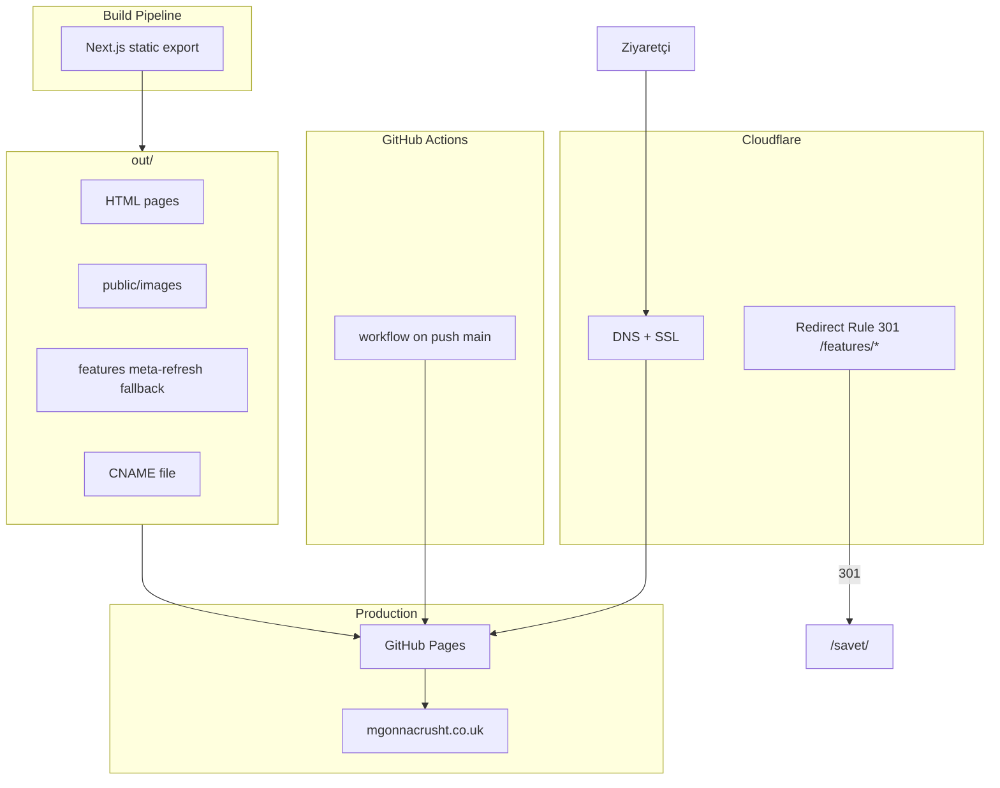
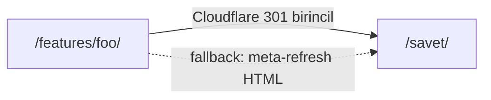

# MgonnacrushT — Next.js Site Migration Plan (Cloudflare güncellemesi)

## Karar özeti

| Konu | Karar |
|------|--------|
| Hosting | GitHub Pages (`mgonnacrusht.co.uk`, [`CNAME`](CNAME) korunur) |
| Deploy | GitHub Actions → `out/` artifact → GitHub Pages |
| **DNS/Redirect altyapısı** | **Cloudflare (nameserver taşınacak, domain kaydı Hostinger'da kalır) — gerçek 301 için zorunlu** |
| Branch | `version2` → `main` merge ile canlı |
| Tema | Light-only v1, clarity-first minimalizm |
| Ana sayfa | Ajans/hizmet öncelikli; SaveT güçlü case study teaser |
| Legal | Metinler aynen; URL'ler değişmez |
| Legacy `/features/*` | Tek adımda `/savet/` yönlendirme (Cloudflare 301 birincil) |
| Roadmap | Kodda hazır, nav/sitemap'te gizli |
| Form | Formspree |
| Analytics | Umami korunur |
| i18n | Şimdilik EN; içerik katmanı esnek |

---

## Mimari genel bakış

---

## 1. Sayfa yapısı ve section sırası

*(Önceki plandan değişmedi — özet)*

- **`/`** — Agency hero → services snapshot → SaveT case study teaser → portfolio preview → founder strip → contact CTA → footer
- **`/services/`** — Hero, 6 service cards, delivery scope, engagement CTA
- **`/products/`** — Portfolio (URL korunur): SaveT featured kart + 2–3 placeholder proje kartı
- **`/savet/`** — Flagship case study: problem → solution → result → 3 adım → use cases (8 feature birleşik) → video → pricing → Play Store CTA (env-gated)
- **`/savet/roadmap/`** — Gizli (`showRoadmap: false`, `noindex`, agent yorumları)
- **`/about/`** — Solo founder hikayesi + fotoğraf
- **`/contact/`** — Formspree form + inquiry buckets
- **Legal (4 sayfa, metin verbatim):** `/legal/privacy/`, `/legal/terms/`, `/savet/legal/privacy/`, `/savet/legal/terms/`

21st.dev bileşen eşlemesi önceki planda olduğu gibi: `navbar`, `hero-section`, `feature-grid`, `portfolio-grid`, `contact-form`, `footer`, `accordion`, `stats`, `timeline`.

---

## Legacy redirect stratejisi (`/features/*` → `/savet/`)

8 kaynak URL ([`sitemap.xml`](sitemap.xml)):

- `/features/movies-tv-watchlist/`
- `/features/restaurants-cafes-to-try/`
- `/features/articles-videos-to-revisit/`
- `/features/personal-projects-learning/`
- `/features/collaboration-shared-lists/`
- `/features/browser-extension-desktop/`
- `/features/shopping-and-wishlists/`
- `/features/api-integrations-discovery/`

### Birincil çözüm: Cloudflare Redirect Rule

- **Koşul:** URI Path starts with `/features/`
- **Aksiyon:** Dynamic redirect → `https://mgonnacrusht.co.uk/savet/` — **301 Permanent**
- **Tek adım:** zincir yok, doğrudan hedefe gider
- Cloudflare edge'de istek GitHub Pages'e ulaşmadan yakalanır

### Fallback / yedek: build-time meta-refresh sayfaları

- [`scripts/generate-legacy-redirects.mjs`](scripts/generate-legacy-redirects.mjs) her slug için `public/features/<slug>/index.html` üretir
- İçerik: `link rel=canonical`, `meta http-equiv=refresh`, `location.replace()` — kullanıcı tek adımda `/savet/`'e gider
- **Kodda kalır:** Cloudflare devreye girene kadar veya herhangi bir aksaklıkta çalışır durumda
- **Çakışma yok:** Cloudflare önce yakaladığı için ikisi birlikte aktif olsa bile normal trafikte Cloudflare kuralı önceliklidir; fallback sadece edge bypass senaryolarında devreye girer

Eski `/features/*` URL'leri yeni `sitemap.xml`'de **olmayacak** (GSC'de manuel güncelleme).

---

## 2. Dosya / klasör yapısı

Önceki plandan aynı — App Router, `lib/content/`, `lib/config/site.ts`, `public/images/`, `public/features/` (fallback redirects), `.github/workflows/deploy.yml`. Jekyll artefaktları migration sonrası kaldırılır.

---

## 3. Tasarım sistemi ve 21st.dev

Önceki plandan değişmedi: light-only, bold typography, Framer Motion micro-interactions, 21st.dev registry via `npx shadcn@latest add`.

---

## 4. SEO checklist

Önceki plandan aynı: per-page metadata, `sitemap.ts`, JSON-LD, semantic HTML, Lighthouse 90+ hedefi. `/features/*` ve gizli roadmap sitemap dışı.

---

## 5. Config ve entegrasyonlar

[`lib/config/site.ts`](lib/config/site.ts): `showRoadmap`, `playStoreUrl`, `formspreeFormId`, Umami ID, email alias'ları.

**GitHub Actions:** push to `main` → build → export → legacy redirect script → deploy. Pages source = GitHub Actions.

**Cloudflare (senin yapacağın, kodla paralel):** aşağıdaki Faz 5A.

---

## 6. Adım adım uygulama sırası

### Faz 0 — Hazırlık (kod)
1. Jekyll içeriği → `lib/content/` + `lib/content/legal/` (verbatim)
2. Görseller → `public/images/`
3. Next.js scaffold + `next.config.ts` (`output: 'export'`, `trailingSlash: true`)
4. shadcn + 21st.dev registry

### Faz 1 — İskelet (kod)
5. `site.ts`, `layout.tsx`, Navbar, Footer, navigation
6. `LegalPageLayout` + 4 legal sayfa

### Faz 2 — Çekirdek sayfalar (kod)
7. `/services/`, `/about/`, `/contact/`, `/products/`

### Faz 3 — SaveT (kod)
8. `/savet/` case study + Play Store CTA (env-gated)
9. `/savet/roadmap/` gizli sayfa

### Faz 4 — Home (kod)
10. `/` agency-first tüm section'lar

### Faz 5A — Cloudflare kurulumu (sen — kodla paralel, birbirini bloklamaz)

GitHub Actions deploy'dan **önce veya sonra** yapılabilir; DNS propagasyonu beklerken kod tarafı devam eder.

| Adım | İş |
|------|-----|
| a | Hostinger DNS panelindeki tüm kayıtları yedekle/not al (A, CNAME, MX, TXT/SPF/DKIM) |
| b | Cloudflare'e site ekle (`mgonnacrusht.co.uk`), otomatik DNS taramasını doğrula |
| c | Taranan kayıtları manuel kontrol et — **özellikle MX ve SPF/DKIM TXT** eksiksiz aktarıldı mı |
| d | Hostinger'da nameserver'ları Cloudflare'inkilerle değiştir (domain kaydı Hostinger'da kalır) |
| e | Cloudflare DNS'te GitHub Pages kayıtlarını doğrula: `@` → GitHub Pages A kayıtları veya CNAME flattening; `www` → `mgonnacrusht.github.io` |
| f | SSL/TLS modu: **Full (strict)** |
| g | Redirect Rule: URI Path starts with `/features/` → 301 dynamic redirect → `https://mgonnacrusht.co.uk/savet/` |
| h | Propagasyon sonrası (birkaç saat – 48 saat): 8 eski URL + MX/e-posta akışını manuel test et |

### Faz 5B — SEO, redirect fallback, deploy (kod)

11. `metadata.ts` + OG images
12. `sitemap.ts` + `robots.ts`
13. JSON-LD components
14. `generate-legacy-redirects.mjs` — 8 `/features/*` fallback HTML (Cloudflare yedek)
15. GitHub Actions workflow
16. Jekyll cleanup, `netlify.toml` kaldır
17. `savet_prompt_agent_summary.txt` + cursor rules güncelle

### Faz 6 — QA ve merge
18. Lighthouse 90+ audit
19. URL doğrulama: 4 legal + 8 redirect (Cloudflare 301 header kontrolü: `curl -I` ile `301` + `Location: .../savet/`)
20. E-posta gönder/al testi (MX sağlam mı)
21. `version2` → `main` merge
22. GSC: yeni sitemap submit + eski `/features/*` redirect izleme

---

## Placeholder portföy verisi

[`lib/content/portfolio.ts`](lib/content/portfolio.ts) — 2–3 placeholder kart; gerçek içerik sonra senin tarafından doldurulur.

---

## Riskler ve notlar

- **MX kaydı kaybı riski:** Nameserver değişikliği sırasında e-posta kesilebilir — geçiş öncesi Hostinger DNS yedeği şart; Cloudflare import sonrası MX/SPF/DKIM manuel doğrulama zorunlu
- **Propagasyon süresi:** Birkaç saat boyunca hem meta-refresh fallback hem Cloudflare kuralı aktif olabilir; çakışma yaratmaz (Cloudflare önce yakalar)
- **True HTTP 301:** Cloudflare Redirect Rule birincil çözüm; meta-refresh yalnızca fallback
- **Formspree:** Honeypot field ekle (spam)
- **YouTube embed:** Facade pattern Lighthouse için düşün
- **Cursor rules:** SaveT slogan, email alias map, agent summary sync korunmalı
