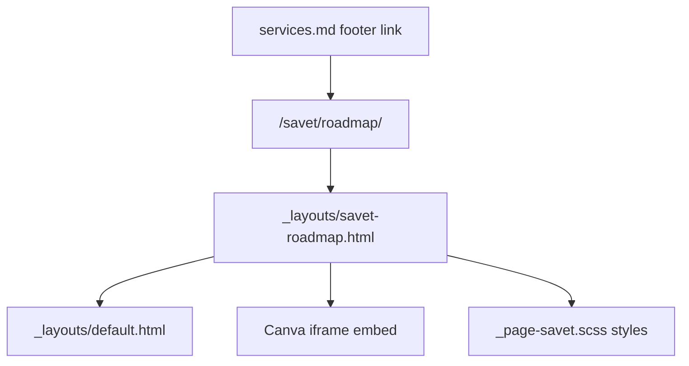

# SaveT Roadmap Page

## Approach

Add a dedicated SaveT subpage at `/savet/roadmap/` following the same routing pattern as existing SaveT legal pages ([`savet-legal-privacy.html`](savet-legal-privacy.html)): root-level file + explicit `permalink`, not a `savet/` folder.

Use a **new layout** rather than generic `page` layout so the Canva embed is structured cleanly and inherits SaveT visual language (`page-savet` body class, hero typography, strip sections, shadow/radius patterns from [`.savet-video-wrap`](_sass/pages/_page-savet.scss)).



## Files to create

### 1. [`savet-roadmap.html`](savet-roadmap.html) (new page)

Front matter (English copy, Turkish attribution fields):

```yaml
title: SaveT Roadmap · MgonnacrushT
layout: savet-roadmap
description: SaveT product roadmap — planned features, milestones, and what comes next.
permalink: "/savet/roadmap/"
hero_title: "Roadmap"
eyebrow: "SaveT"
lead: "A look at where SaveT is headed — features, milestones, and what comes next."
canva_embed_url: "https://www.canva.com/design/DAHKqECSnws/6kw1-VOIRWtEerHwGmnLEQ/view?embed"
canva_view_url: "https://www.canva.com/design/DAHKqECSnws/6kw1-VOIRWtEerHwGmnLEQ/view?utm_content=DAHKqECSnws&utm_campaign=designshare&utm_medium=embeds&utm_source=link"
canva_title: "SavetRoadMap"
canva_author: "ALİHAN Ersoy"
cta:
  label: "Back to SaveT"
  url: "/savet/"
cta_secondary:
  label: "Get early access"
  url: "/contact/"
```

No markdown body needed; layout renders all content from front matter.

### 2. [`_layouts/savet-roadmap.html`](_layouts/savet-roadmap.html) (new layout)

Structure:

- `bodyClass: "page-savet page-savet-roadmap"` on `default` layout
- **Hero** — reuse SaveT hero class names (`savet-hero`, `savet-hero-title`, `savet-hero-lead`, `savet-hero-cta`) with optional `eyebrow` rendered as a small uppercase label (same pattern as [`_layouts/page.html`](_layouts/page.html) `page-hero-eyebrow`, styled via SaveT tokens)
- **Roadmap strip** — `strip strip-grey savet-roadmap-strip` with centered column (`col-12 col-lg-9`)
- **Canva embed** — semantic wrapper `.savet-canva-wrap` containing lazy-loaded iframe (user-provided embed URL from front matter)
- **Attribution** — `.savet-canva-attribution` below embed: Turkish title link + author credit, `target="_blank" rel="noopener"`

Inline styles from the Canva snippet will be **moved into SCSS** for maintainability and consistency with [`.savet-video-wrap`](_sass/pages/_page-savet.scss).

## Files to update

### 3. [`_sass/pages/_page-savet.scss`](_sass/pages/_page-savet.scss)

Add scoped rules under `.page-savet-roadmap`:

| Class | Purpose |
|-------|---------|
| `.savet-roadmap-strip` | Section padding; centers content |
| `.savet-canva-wrap` | Portrait aspect ratio (~100 / 141.43), rounded corners, shadow matching video wrap, `overflow: hidden`, max-width ~860px centered |
| `.savet-canva-wrap iframe` | Absolute fill, borderless |
| `.savet-canva-attribution` | Subtle centered credit line (`$steel`, small type, link hover → `$primary`) |
| `.savet-roadmap-eyebrow` | SaveT-red uppercase eyebrow in hero |

Use modern `aspect-ratio: 100 / 141.4286` with a `padding-top` fallback if needed for older browsers — mirrors Canva's embed ratio exactly.

### 4. [`services.md`](services.md)

Add roadmap link to the existing footer line (alongside privacy/terms):

```markdown
[SaveT Roadmap](/savet/roadmap/)
```

### 5. [`sitemap.xml`](sitemap.xml)

Add entry after `/savet/`:

```xml
<url>
  <loc>https://mgonnacrusht.co.uk/savet/roadmap/</loc>
  <priority>0.75</priority>
</url>
```

## Design notes

- **Language:** Hero, lead, CTAs, and meta description in English; Canva attribution stays Turkish as provided.
- **Navigation:** No change to [`_data/menus.yml`](_data/menus.yml) — discoverable only from `/savet/` footer (per your choice).
- **Brand consistency:** Reuse SaveT color tokens (`$primary`, `$black`, `$steel`, `$white-offset`), Playfair Display headings, and the video-wrap shadow/radius language so the page feels native to SaveT, not a raw embed dump.
- **Mobile:** Full-width embed on small screens; constrained max-width on desktop so the tall Canva canvas remains readable without overwhelming the viewport width.
- **No `assets/savet_prompt_agent_summary.txt` update** unless you want the roadmap URL reflected in agent copy — out of scope unless requested.

## Verification

After implementation, confirm locally or on deploy:

1. `/savet/roadmap/` loads with hero, embed, and attribution
2. Canva iframe is interactive (scroll/zoom within embed)
3. "Back to SaveT" and "Get early access" CTAs work
4. Footer link on `/savet/` reaches the new page
5. Page inherits SaveT styling (`page-savet` body class visible in DOM)

Suggested commit message when ready: `Add SaveT roadmap page with embedded Canva design`
