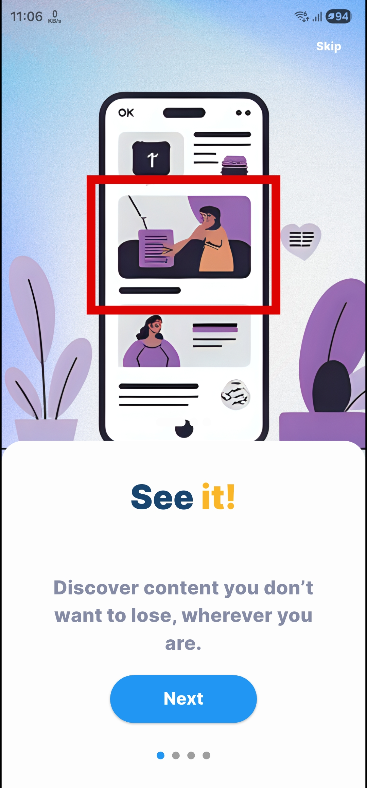
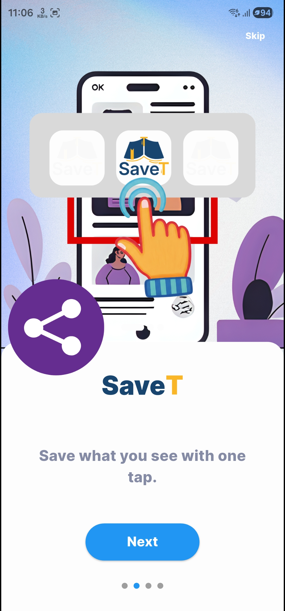
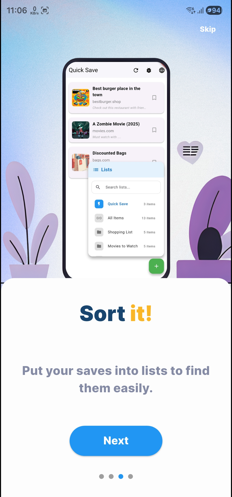

# SaveT: See it. SaveT. Sort it.

SaveT is a cross-platform app by MgonnacrushT that helps you save now and organize later, without losing important links, media, places, and ideas across multiple tools.

## Why SaveT

Most people save content in too many places: browser tabs, notes, screenshots, maps, and app-specific lists. SaveT gives you one reliable home for everything you want to revisit.

## Core capabilities

- Quick Save flow for fast capture.
- Nested lists for clean organization.
- Search with list-path context to find items faster.
- Edit support for title, description, tags, and metadata.
- AI-assisted enrichment for better item quality.
- Safer data handling with soft-delete behavior.

## How SaveT works

### 1) See it
Spot a useful link, place, video, article, or idea worth keeping.

### 2) SaveT
Capture it in seconds and place it in the right list.

### 3) Sort it
Use nested structure, tags, and search to keep everything easy to retrieve.

## How to use SaveT (video)

Short walkthrough video:

<iframe width="560" height="315" src="https://www.youtube.com/embed/H98Z6c8uutc" title="How to use SaveT" frameborder="0" allow="accelerometer; autoplay; clipboard-write; encrypted-media; gyroscope; picture-in-picture; web-share" allowfullscreen></iframe>

## Pricing roadmap

- Initial release: free plan with minimal, non-intrusive ads.
- Later stage: optional premium features (for example, advanced AI and no-ads experience).
- Future experiments: affiliate-supported discovery features with clear disclosure.

For company engineering services, visit [Services](/services/).  
[About MgonnacrushT](/about/) | [Contact us](/contact/) | [SaveT Privacy Policy](/savet/legal/privacy/) | [SaveT Terms of Use](/savet/legal/terms/)
